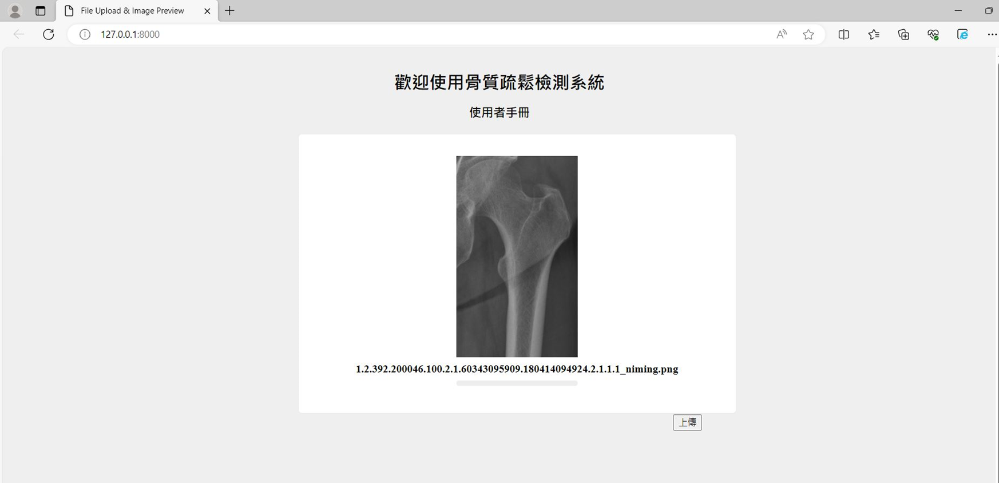

# Final year project
## Implement an Osteoporosis screening system with using X-ray radiography via Deep learning

### Overview
This experiment focuses on deep learning and osteoporosis, aiming to address the hidden issues within osteoporosis, such as cost, space, speed, and accessibility, through deep learning methods. The goal is to fundamentally solve the problems osteoporosis brings to society while simultaneously creating economic value.

Osteoporosis is a common chronic disease primarily caused by bone loss due to aging. The destruction of these microstructures poses a significant threat to the lives of the elderly, especially for those with poor diets, lack of regular exercise, or a family history of the condition.

In clinical settings, the diagnosis and monitoring of osteoporosis are currently based on the bone mineral density (BMD) measured by dual-energy X-ray absorptiometry (DEXA), which is considered the gold standard. This experiment aims to leverage the high-resolution advantage of X-ray images, combined with real clinical data, to train a deep learning model for osteoporosis detection. Additionally, a user interface will be developed to provide a simple yet effective analysis of osteoporosis, helping patients detect the condition early and receive timely treatment.

### Flowchart

### Experimental Procedure

1. **Data Collection and Preprocessing**  
   Organize data from the hospital and use Oracle databases to match patient DEXA and X-ray data, followed by data preprocessing.

2. **Data Augmentation**  
   Solve the issue of limited data and address overfitting encountered during training.

3. **Model Training**  
   Compare different CNN model architectures. Use X-ray images of femur from 2018 to 2021 as the training set, and 2022 data as the test set.

4. **User Interface**  
   Integrate the trained model with Django to implement the API for the detection system.
   

### Result

#### This is the home page; users can upload the femur X-ray to get the result.

#### This is the result if you were diagnosed with osteoporosis, also with a heat map in which position you have been detected with osteoporosis.

